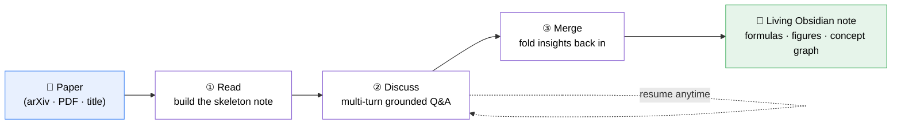
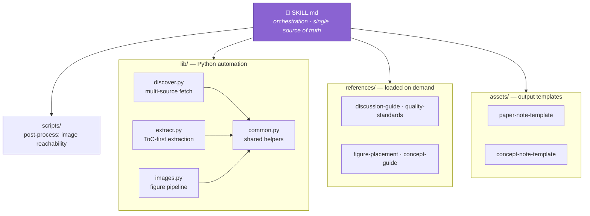

<div align="center">

# 📄 Paper Assistant

### Don't just *read* papers. **Understand** them.

An interactive academic-paper reading agent that turns a PDF or arXiv link into a living, structured Obsidian note — through reading, multi-turn Q&A, and merge-back-into-notes.

[](https://github.com/GehenHe/papernote-assistant-skill/stargazers)
[](LICENSE)
[](https://claude.ai/code)
[](https://developers.openai.com/codex/skills)
[](#-contributing)

<samp>📥 Paper&nbsp;&nbsp;→&nbsp;&nbsp;🤖 Multi-turn dialogue&nbsp;&nbsp;→&nbsp;&nbsp;📝 Structured Obsidian note</samp>

</div>

<!--
═══════════════════════════════════════════════════════════════════
  HERO DEMO — drop your screenshot/GIF here for maximum star appeal.
  1. Add the file to  docs/demo.gif  (a 10–20s screen recording of a
     read → ask → note-updates loop is ideal).
  2. Delete this comment block and uncomment the  line below.

  <p align="center"></p>
═══════════════════════════════════════════════════════════════════
-->

> [!NOTE]
> 🎬 **Live demo coming soon.** In the meantime, scroll to [**See it in action**](#-see-it-in-action) for a real generated note.

---

## 💡 Why Paper Assistant?

Reading a paper isn't the hard part. **Understanding it is.**

Summarizers and translators give you a *digest* — but they can't tell you *why* a method is designed the way it is, what each symbol in an equation means, or what a result implies for **your own** research direction. That understanding only gets built in conversation.

Paper Assistant treats a paper note as **alive**: the first read is just a skeleton — understanding accrues as you ask questions, and every insight is merged back into a permanent, searchable note.



| Phase | What happens | You get |
|:--|:--|:--|
| **① Read** | Auto-extracts the paper's core: contributions, problem, method, experiments, figures, formulas — into a structured note | A complete first-draft note |
| **② Discuss** | Ask anything — method details, equation derivations, experiment design, relevance to your field. Answers are grounded in the paper, with section/figure/equation anchors | A discussion log that keeps the *reasoning*, not just conclusions |
| **③ Merge** | Distilled understanding is folded back into the right sections; concept `[[wikilinks]]` are auto-created and backlinked | A deep, permanent note + a growing concept graph |

---

## ✨ Features

| | Feature | What it does |
|:-:|:--|:--|
| 🧠 | **8 tailored Q&A strategies** | Concept explanation, problem-framing, design rationale, comparison, critique… each question type gets a different response depth and structure |
| 🔎 | **Multi-source discovery** | arXiv HTML→PDF fallback; title → arXiv search → HuggingFace → project page; local PDF. Never assumes everything lives on arXiv |
| 📖 | **Long-paper smart extraction** | >30 pages auto-triggers a ToC-first strategy: Intro (full) → Method (skim) → Main results → Conclusion |
| 🖼️ | **Automatic figure capture** | Pulls `<figure>` images from arXiv HTML, falls back to `pdfimages`/PyMuPDF, dedupes URLs, and checks reachability — never writes a reference to an image that doesn't exist |
| 🔗 | **Bidirectional concept graph** | Technical terms become `[[wikilinks]]`; each concept note backlinks every paper that uses it |
| 🧩 | **One source, many platforms** | A single standard `SKILL.md` runs unchanged on Claude Code, Codex, and other agent hosts |

---

## 👀 See it in action

> A trimmed excerpt of a note Paper Assistant generated for *"Overthinking Reduction with Decoupled Rewards and Curriculum Data Scheduling"* (ICLR 2026).

````markdown
---
title: "Overthinking Reduction with Decoupled Rewards and Curriculum Data Scheduling"
method_name: "DeCS"
year: 2025
venue: "ICLR 2026 Oral"
tags: [overthinking, reasoning, RLVR, GRPO, curriculum-learning]
status: enriched
discussion_rounds: 4
---

## 一句话总结
> DeCS 用解耦 token 级奖励 + 课程调度，在 7 个 benchmark 上将推理 token 减少 ~50%，
> 同时维持或提升 pass@1。


## 方法概览 › 解耦 Token 级奖励
$$
r_{i,j} = \begin{cases}
r_+ \cdot \mathbf{1}_{\text{correct}} & j \leq K^* \\
\left(r_0 - (r_+ - r_0)\tfrac{L_i}{L_{\max}}\right)\cdot \mathbf{1}_{\text{correct}} & j > K^*
\end{cases}
$$
NRP 内 token 给正奖励；NRP 后的冗余 token 按长度比例衰减。关联概念：[[必要推理前缀]] · [[GRPO]]

## 讨论与问答
### 话题1: 现有长度惩罚的两个根本缺陷  `2026-06-14`
**关键结论**: 缺陷一里一外——NRP 内被误伤、NRP 后逃过惩罚。根因是 trajectory 级
奖励粒度不够，DeCS 改为 token 级分段赋奖励…
````

**The note carries real structure:** YAML frontmatter, rendered LaTeX, embedded figures, `[[concept]]` links, and a discussion log that preserves *how* the understanding was built — all ready to open in Obsidian.

---

## 🚀 Quick start

### 1. Install

A single skill, installed wherever your agent looks for skills:

```bash
# Claude Code
git clone https://github.com/GehenHe/papernote-assistant-skill.git ~/.claude/skills/paper-assistant

# Codex (repo-level — scanned from your cwd up to the repo root)
git clone https://github.com/GehenHe/papernote-assistant-skill.git .agents/skills/paper-assistant
```

> [!TIP]
> `SKILL.md` is the single source of truth — the **same** frontmatter and body are read by every platform. Only the install path differs.

### 2. Read a paper

```text
读论文 https://arxiv.org/abs/2509.25827          # arXiv link
读论文 Attention Is All You Need                  # title (auto-searches sources)
读论文 /path/to/paper.pdf                          # local PDF
```

### 3. Discuss, then resume anytime

```text
继续讨论 DeCS                                      # pick up where you left off
```

> The reading experience and generated notes are **in Chinese by default** (the skill targets a Chinese research-notes workflow); the trigger phrases above work in both Chinese and English.

---

## 🏗️ How it works

A four-layer modular design — `SKILL.md` is the conductor, not the orchestra.



- **`SKILL.md`** — phase-level orchestration (WHAT + WHEN). Stays lean and tool-agnostic.
- **`lib/*.py`** — CLI-callable automation with JSON output; degrades gracefully and the agent can always fall back to fetching directly.
- **`references/*.md`** — detailed guides loaded only at the phase that needs them.
- **`assets/*.md`** — templates for the generated paper and concept notes.

---

## 📦 Requirements

| Dependency | Level | Notes |
|:--|:-:|:--|
| `curl` | **required** | image reachability checks |
| `PyMuPDF` (`pip install pymupdf`) | optional | enables proper page-aware long-paper extraction |
| `poppler-utils` (`pdfimages`) | optional | PDF figure extraction fallback |

> [!NOTE]
> Works cross-platform (Windows / macOS / Linux). Temp paths, shell tool checks, and text encoding are all handled per-platform — no Unix-only assumptions.

<details>
<summary>📁 <b>Project structure</b></summary>

```text
paper-assistant/
├── SKILL.md                      # Skill entry — orchestration, single source of truth
├── lib/                          # Python automation library
│   ├── discover.py               #   multi-source paper discovery & download
│   ├── extract.py                #   ToC-first content extraction
│   ├── images.py                 #   figure acquisition pipeline
│   └── common.py                 #   shared helpers (paths, ids, encoding)
├── scripts/
│   └── download_note_images.py   # post-process: reachability check + localization
├── assets/
│   ├── paper-note-template.md    # Obsidian paper-note template
│   └── concept-note-template.md  # concept-note template
├── references/
│   ├── discussion-guide.md       # 8 Q&A response strategies
│   ├── quality-standards.md      # formula / table / figure quality rules
│   ├── image-troubleshooting.md  # figure-acquisition troubleshooting
│   ├── figure-placement.md       # figure distribution rules
│   └── concept-guide.md          # concept-library maintenance guide
└── CLAUDE.md                     # architecture + cross-platform portability contract
```

</details>

---

## 🗺️ Roadmap

- [ ] Live demo GIF in the hero
- [ ] Zotero source resolution
- [ ] Per-direction "Map of Content" index generation
- [ ] English note-output mode

---

## 🤝 Contributing

Issues and PRs are welcome — bug reports, new Q&A strategies, additional source resolvers, or platform adapters.
`SKILL.md` is the single source of truth; keep its body tool-agnostic so it stays portable across agent platforms (see [`CLAUDE.md`](CLAUDE.md)).

## ⭐ Star this repo

If Paper Assistant saves you time on your next paper, a star helps others find it — and motivates continued work.

## 📄 License

[MIT](LICENSE)
